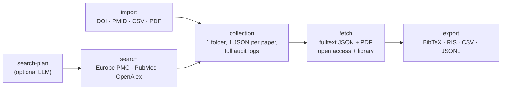

# paper-download

**Search the literature, download structured full text and PDFs, and keep the
whole collection auditable.**

[](https://github.com/hfl112/paper-download/actions/workflows/ci.yml)
[](LICENSE)
[](pyproject.toml)

Turn a PubMed / Europe PMC / OpenAlex query, a DOI/PMID list, or a folder of
PDFs into a local collection: one folder per collection, one `article.json`
per paper (metadata + structured full text), optional **`article.pdf`**
downloads (open access, or paywalled through *your own* institutional login),
citation exports (BibTeX / RIS / CSV / JSONL), and a `logs/*.json` audit trail
for every command.



## Install

```bash
pip install "paper-download[browser,pdf,llm] @ git+https://github.com/hfl112/paper-download.git"
paper-download --help
```

Extras are optional: `browser` = library/paywalled access, `pdf` = import from
local PDFs, `llm` = LLM-assisted search plans. The core (search, open-access
full text + PDFs, exports) needs none of them.

From a clone, no install needed: `python paper_download.py <command>` is the
same CLI. Optional config: copy `.env.example` to `.env` (see
[Configuration](#configuration)).

## Quick start

```bash
# 1. gather papers
python paper_download.py search --collection demo --query 'pediatric preclinical testing program AND "drug response"' --max 20

# 2. download full text JSON and PDFs (open access)
python paper_download.py fetch --collection demo --output-format both --access open

# 3. review and export
python paper_download.py status --collection demo
python paper_download.py collection export --collection demo --to bib
```

Everything lands in plain files you can read, diff, and version:

```text
data/collections/demo/
├── collection.json                  # collection manifest
├── articles.csv                     # one-line-per-paper index
├── articles/
│   └── doi_10_1002_pbc_21508/
│       ├── article.json             # metadata + structured full text + status
│       └── article.pdf              # downloaded PDF (with --output-format pdf|both)
└── logs/
    ├── search_<timestamp>.json      # what was searched, what was added
    ├── fetch_<timestamp>.json       # what was fetched, what failed and why
    └── status_<timestamp>.json      # collection state over time
```

Failures are never hidden: a paper with no accessible full text stays in the
collection with its status recorded per article and in the fetch log.

## The agent Skill

The repo ships a Skill that teaches AI coding agents (Claude Code, Codex, …)
to drive the CLI from plain language. Install the CLI first, then:

```bash
skillshare install hfl112/paper-download/skill/paper-download
skillshare sync
```

Then just ask in plain language, for example:

> *"Build a collection of papers on PPTP drug response, download the
> open-access full text and PDFs, and export a BibTeX file."*

> *"Import these 50 DOIs, then use my library access to get the PDFs that
> aren't open access."*

## Downloading PDFs

`fetch` downloads PDFs whenever `--output-format` is `pdf` or `both`; each PDF
is saved as `articles/<article_id>/article.pdf` and its provenance recorded in
`article.json`.

- `--access open` (default) — open-access PDFs only (PMC, Unpaywall,
  publisher OA APIs). No setup needed:

  ```bash
  python paper_download.py fetch --collection demo --output-format pdf --access open
  ```
- `--access library` — paywalled PDFs through your institution's login in a
  real browser. Log in once, then batch:

  ```bash
  python paper_download.py library login                 # SSO / EZProxy (or: --libkey, --from-chrome)
  python paper_download.py library doctor                # check the session is ready
  python paper_download.py fetch --collection demo --output-format both --access library --speed normal
  ```

- `--access both` — try open access first, fall back to the library:

  ```bash
  python paper_download.py fetch --collection demo --output-format both --access both
  ```

Library access only ever uses **your own valid credentials**, never stores
them, and strips proxy/login links (flagged `sensitive`) from every export.
You are responsible for your institution's acceptable-use policy and publisher
Terms of Service; keep batches reasonable and use `--speed normal|slow`.
Details and troubleshooting: [skill/paper-download/references/library-access.md](skill/paper-download/references/library-access.md).

## Commands and parameters

Global shape: `python paper_download.py <command> [options]`. Every command
requires `--collection <name>` (the folder under `data/collections/`).

### `search` — query sources, add metadata to the collection

| Option | Meaning |
|---|---|
| `--query '...'` | query string (Europe PMC syntax; `AUTH:"Houghton PJ"` works) |
| `--plan <file>` | run a saved `search-plan` instead of `--query` |
| `--min-year`, `--max-year` | publication-year window |
| `--max <n>` | max results per source (default 1000) |
| `--source <name>` | repeatable; limit to `epmc`, `pubmed`, `openalex` (default: all; arXiv arrives via OpenAlex) |

A long query is fine: Europe PMC is queried through its `searchPOST` endpoint, so a
several-thousand-character query does not hit the URL length limit.

### `fetch` — download fulltext JSON and/or PDFs

| Option | Meaning |
|---|---|
| `--output-format json\|pdf\|both` | required; what to download. `json` = structured full text, `pdf` = `article.pdf`, `both` = both |
| `--access open\|library\|both` | where from (default `open`); see [Downloading PDFs](#downloading-pdfs) |
| `--limit <n>` | stop after n articles |
| `--force` | re-fetch articles already done |
| `--non-interactive` | never open a login browser; fail fast without a saved library session |
| `--speed fast\|normal\|slow` | library throttle between articles: 8s fixed / 5–60s random / 50–300s random (default `fast`) |

### `status` — print and log collection state

No options beyond `--collection`. Prints article counts, fulltext/PDF
availability, quality grades, and failures.

### `collection import` — add papers by identifier or file

| Option | Meaning |
|---|---|
| `--input <csv>` | CSV with a `doi` and/or `pmid` column |
| `--input-json <file>` | JSON list of article records |
| `--input-doi <doi>` | repeatable; single DOI |
| `--input-pmid <pmid>` | repeatable; single PMID |
| `--input-pdf <path>` | repeatable; local PDF file or directory — metadata is read from the PDF and enriched via Europe PMC |

### `collection export` — write citation files

| Option | Meaning |
|---|---|
| `--to bib\|ris\|csv\|jsonl` | required; output format (`jsonl` includes full text, RAG-ready) |
| `--output <file>` | output path (default: `<collection>.<ext>` in the current dir) |

### `search-plan` — reproducible search plan (optional, LLM-assisted)

Writes a reviewable plan file that `search --plan` executes; useful when a
query should be documented and repeatable.

| Option | Meaning |
|---|---|
| `--keyword '...'` | repeatable; key concepts (mutually exclusive with `--prompt`) |
| `--prompt '...'` | natural-language topic; an LLM proposes keywords/aliases |
| `--anchor '...'` | repeatable; concept that must always match (AND-ed; must also be a `--keyword`) |
| `--match <m>` | M-of-N: how many key concepts must match (default: all) |
| `--min-year`, `--max-year` | publication-year window |
| `--no-llm` | keyword mode only, skip the LLM |
| `--no-confirm` | skip interactive alias confirmation |
| `--provider`, `--model` | LLM choice: `gemini\|openai\|deepseek\|claude` (default: auto), explicit model id |

### `library login` / `library doctor` — institutional access setup

| Option | Meaning |
|---|---|
| *(login, no flags)* | open a browser, log in via SSO / "Access through your institution"; session saved for `--access library` |
| `--libkey` / `--no-libkey` | force / skip loading a LibKey Nomad extension (default: auto if installed) |
| `--from-chrome` | borrow institutional cookies from your real Chrome instead of opening a browser |
| `--all-domains` | with `--from-chrome`: import all cookies, not just academic hosts |
| `--landing-url <url>` | page to open for login (default: a paywalled article, to make access visible) |
| `--proxy-login-url <tpl>` | EZProxy template, e.g. `https://libproxy.<school>.edu/login?url={target}` |
| `--headless` | no browser window |
| `doctor [--json]` | read-only readiness check of the saved session |

## Configuration

Copy `.env.example` to `.env`; everything is optional.

| Variable | Purpose |
|---|---|
| `PAPER_DOWNLOAD_EMAIL` | polite-request email for Unpaywall / NCBI / OpenAlex |
| `NCBI_API_KEY` | faster PubMed / PMC (3 → 10 req/s) |
| `SPRINGER_OA_API_KEY`, `ELSEVIER_API_KEY`, `WILEY_TDM_TOKEN`, `CORE_API_KEY` | publisher OA fulltext APIs |
| `LLM_PROVIDER` + one of `GEMINI_API_KEY` / `OPENAI_API_KEY` / `DEEPSEEK_API_KEY` / `ANTHROPIC_API_KEY` | `search-plan --prompt` |
| `PAPER_DOWNLOAD_ROOT` | where `data/` lives (default: repo root) |

## What's in this repo

```text
paper_download/          # the engine (CLI + library)
llmclient/               # bundled provider-agnostic LLM client (used by search-plan)
skill/paper-download/    # the agent Skill (SKILL.md + references)
tests/                   # offline unit + smoke tests: bash tests/run_all.sh
```

## License

[MIT](LICENSE).
